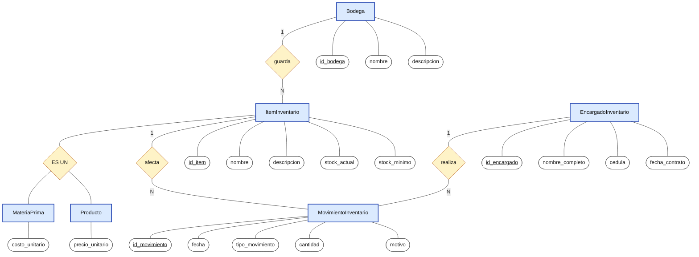

Este es el código en Mermaid correspondiente al diagrama:

````markdown

```mermaid
flowchart TB
    classDef default fill:#ffffff,stroke:#555,color:#111
    classDef ent fill:#dbeafe,stroke:#1e40af,stroke-width:2px,color:#111
    classDef rel fill:#fef3c7,stroke:#b45309,color:#111

    Bod["Bodega"]:::ent
    Item["ItemInventario"]:::ent
    MP["MateriaPrima"]:::ent
    Prod["Producto"]:::ent
    Enc["EncargadoInventario"]:::ent
    Mov["MovimientoInventario"]:::ent

    R1{"guarda"}:::rel
    ISA{"ES UN"}:::rel
    R2{"afecta"}:::rel
    R3{"realiza"}:::rel

    Bod ---|1| R1 ---|N| Item
    Item --- ISA
    ISA --- MP
    ISA --- Prod
    Item ---|1| R2 ---|N| Mov
    Enc ---|1| R3 ---|N| Mov

    Bod --- a1(["<u>id_bodega</u>"]) & a2(["nombre"]) & a3(["descripcion"])
    Item --- b1(["<u>id_item</u>"]) & b2(["nombre"]) & b3(["descripcion"]) & b4(["stock_actual"]) & b5(["stock_minimo"])
    MP --- c1(["costo_unitario"])
    Prod --- d1(["precio_unitario"])
    Enc --- e1(["<u>id_encargado</u>"]) & e2(["nombre_completo"]) & e3(["cedula"]) & e4(["fecha_contrato"])
    Mov --- f1(["<u>id_movimiento</u>"]) & f2(["fecha"]) & f3(["tipo_movimiento"]) & f4(["cantidad"]) & f5(["motivo"])
```
```
